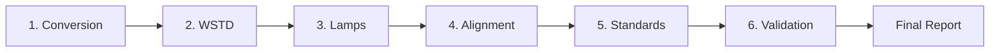

# COREF Suite

**Comprehensive Baseline Correction and Validation Tool for NIR Spectroscopy**

[](https://www.python.org/downloads/)
[](https://streamlit.io)
[]()

---

## 📋 Table of Contents

- [Description](#-description)
- [Key Features](#-key-features)
- [Architecture](#-architecture)
- [Installation](#-installation)
- [Usage](#-usage)
- [Project Structure](#-project-structure)
- [Available Tools](#-available-tools)
- [Guided Workflow](#-guided-workflow)
- [Report Generation](#-report-generation)
- [System Requirements](#-system-requirements)
- [Contributing](#-contributing)
- [License](#-license)

---

## 🎯 Description

**COREF Suite** is a professional tool developed for NIR (Near-Infrared Spectroscopy) equipment service technicians. It provides a complete set of utilities for:

- Baseline correction and alignment after lamp changes
- Optical standards validation
- Fine adjustment through vertical offset
- Automatic generation of professional HTML reports
- Advanced spectral comparison and analysis

The suite integrates multiple tools into an intuitive web interface built with Streamlit, allowing technicians to perform complex maintenance and validation tasks in a guided and documented manner.

---

## ✨ Key Features

### 🔧 Standalone Tools

- **Baseline Adjustment**: Complete 6-step workflow for post-maintenance adjustment
- **Validation Standards**: Optical standards kit validation with statistical analysis
- **Offset Adjustment**: Vertical offset correction with simulation and impact analysis
- **Spectrum Comparison**: Detailed comparative analysis of measurements
- **White Reference Comparison**: White standard (WSTD) comparison
- **File Conversion**: Conversion between .ref and .csv formats

### 📊 Analysis Capabilities

- Spectral validation with correlation, RMS, and maximum difference metrics
- Automatic spectral shift detection
- Critical NIR spectrum region analysis
- Global and individual sample statistics
- Interactive visualizations with Plotly

### 📄 Report Generation

- Professional HTML reports with corporate styling
- Two types of specialized reports:
  - **Validation Report**: For optical standards validation
  - **Offset Adjustment Report**: For offset adjustments with pre/post analysis
- CSV data export for additional analysis
- Complete maintenance process documentation

### 🎨 User Interface

- Modern and responsive web interface
- Custom corporate theme
- Intuitive step-by-step navigation
- Integrated authentication system
- Session management with state recovery

---

## 🏗️ Architecture

```
COREF Suite (14,008 lines of code)
│
├── 📦 Core (3,691 lines)
│   ├── file_handlers.py           # .ref/.csv file handling
│   ├── spectral_processing.py     # Spectral processing
│   ├── validation.py              # Validation logic
│   ├── report_generator.py        # Main report generator
│   ├── validation_kit_report_generator.py
│   └── offset_adjustment_report_generator.py
│
├── 🖥️ Pages (5,025 lines)
│   ├── Baseline adjustment        # Complete guided workflow
│   ├── Validation Standards       # Kit validation
│   ├── Offset Adjustment          # Offset adjustment
│   ├── Spectrum Comparison        # Comparative analysis
│   ├── White Reference            # WSTD comparison
│   └── File Conversion            # Format conversion
│
├── 🎨 UI (2,799 lines)
│   ├── step_01_conversion.py      # Step 1: Conversion
│   ├── step_02_wstd.py            # Step 2: White reference
│   ├── step_03_lamp.py            # Step 3: Lamp comparison
│   ├── step_04_baseline_alignment.py  # Step 4: Alignment
│   ├── step_05_standards.py       # Step 5: Standards loading
│   └── step_06_validation.py      # Step 6: Final validation
│
└── 🛠️ Utils (881 lines)
    ├── plotting.py                # Plotly visualizations
    ├── validators.py              # Validations and checks
    └── control_samples.py         # Control sample management
```

---

## 📥 Installation

### Prerequisites

- Python 3.12 or higher
- pip (Python package manager)
- Git (optional, for cloning the repository)

### Step 1: Clone the repository

```bash
git clone https://github.com/your-organization/coref-suite.git
cd coref-suite
```

### Step 2: Create virtual environment (recommended)

```bash
python -m venv venv

# Windows
venv\Scripts\activate

# Linux/Mac
source venv/bin/activate
```

### Step 3: Install dependencies

```bash
pip install -r requirements.txt
```

### Step 4: Configure authentication

Edit the `auth.py` file and configure your password:

```python
# auth.py
VALID_PASSWORD = "your_password_here"
```

### Step 5: Run the application

```bash
streamlit run app.py
```

The application will automatically open at `http://localhost:8501`

---

## 🚀 Usage

### Quick Start

1. **Authentication**: Enter the configured password
2. **Select tool**: Choose between guided workflow or standalone tools
3. **Upload files**: Upload the necessary TSV/REF/CSV files
4. **Analysis**: Follow the on-screen instructions
5. **Export results**: Download reports and corrected files

### Example: Complete Baseline Adjustment Workflow

```bash
1. File Conversion → Convert .ref to .csv if necessary
2. White Reference → Compare WSTD pre/post maintenance
3. Lamp Comparison → Analyze spectral differences
4. Alignment → Calculate and apply baseline correction
5. Load Standards → Import validation kit
6. Validation → Verify with optical standards
```

### Example: Quick Offset Adjustment

```bash
1. Load reference and current TSV
2. Select standards for analysis
3. Configure offset value
4. Visualize impact on metrics
5. Load baseline and apply correction
6. Download adjusted baseline
7. Generate HTML report
```

---

## 📂 Project Structure

```
coref-suite/
│
├── app.py                      # Main entry point
├── auth.py                     # Authentication system
├── config.py                   # Global configurations (557 lines)
├── session_manager.py          # Session state management (411 lines)
├── buchi_streamlit_theme.py    # Corporate theme (472 lines)
├── requirements.txt            # Project dependencies
├── README.md                   # This file
│
├── core/                       # Main business logic
│   ├── file_handlers.py
│   ├── spectral_processing.py
│   ├── validation.py
│   ├── report_generator.py
│   ├── validation_kit_report_generator.py
│   └── offset_adjustment_report_generator.py
│
├── pages/                      # Standalone tools
│   ├── 1_📐_Baseline_adjustment.py
│   ├── 2_🎯_Validation_Standards.py
│   ├── 3_🎚️_Offset_Adjustment.py
│   ├── 4_🔍_Comparacion_Espectros.py
│   ├── 5_⚪_White_Reference_Comparison.py
│   └── 6_🔄_File_Conversion.py
│
├── ui/                         # Guided workflow components
│   ├── step_01_conversion.py
│   ├── step_02_wstd.py
│   ├── step_03_lamp.py
│   ├── step_04_baseline_alignment.py
│   ├── step_05_standards.py
│   └── step_06_validation.py
│
└── utils/                      # Utilities and helpers
    ├── plotting.py
    ├── validators.py
    └── control_samples.py
```

---

## 🛠️ Available Tools

### 1. Baseline Adjustment (Guided Workflow)

**Purpose**: Complete baseline adjustment process after maintenance

**Steps**:
- Format conversion
- White reference comparison
- Pre/post lamp analysis
- Spectral alignment
- Validation standards loading
- Final validation with report generation

**Outputs**: 
- Corrected baseline (.ref/.csv)
- Complete HTML report
- Validation data in CSV

### 2. Validation Standards (Standalone)

**Purpose**: Independent validation of optical standards kits

**Features**:
- Spectral correlation analysis
- Spectral shift detection
- Validation metrics (Max Δ, RMS, Offset)
- Critical region analysis
- Professional HTML report

**Requirements**: 
- Reference TSV (pre-maintenance)
- Current TSV (post-maintenance)

### 3. Offset Adjustment (Standalone)

**Purpose**: Fine adjustment of vertical baseline offset

**Features**:
- Real-time impact simulation
- Pre/post adjustment comparison
- Global kit analysis
- Interactive charts
- Detailed report with recommendations

**Use cases**:
- Post-validation fine-tuning
- Systematic bias correction
- Alignment with reference equipment

### 4. Spectrum Comparison

**Purpose**: Detailed comparative analysis between measurements

**Visualizations**:
- Spectrum overlay
- Point-by-point differences
- Cumulative differences
- Per-sample statistics

### 5. White Reference Comparison

**Purpose**: White standard (WSTD) comparison

**Analysis**:
- Temporal overlay
- Absolute and relative differences
- Stability statistics
- Drift detection

### 6. File Conversion

**Purpose**: Conversion between baseline formats

**Supported formats**:
- .ref → .csv (with metadata)
- .csv → .ref (preserving header)

---

## 🔄 Guided Workflow

The 6-step guided workflow provides a structured process for complete baseline adjustment:



### Workflow Advantages

- ✅ Step-by-step guided process
- ✅ Automatic validations at each stage
- ✅ Data persistence between steps
- ✅ Impossible to skip critical steps
- ✅ Automatic process documentation
- ✅ Comprehensive final report

---

## 📊 Report Generation

### Validation Report

**Content**:
- Service information
- Executive summary with key metrics
- Applied validation criteria
- Global kit statistics
- Detailed results per standard
- Global spectrum view
- Individual analysis with charts
- Critical region analysis

**Format**: HTML with corporate styling, sidebar navigation, interactive charts

### Offset Adjustment Report

**Content**:
- Service and adjustment information
- Executive summary with impact
- Technical justification of offset
- Pre/post metrics comparison
- Global spectrum view (3 states)
- Original vs adjusted baseline
- Individual analysis per standard
- Final recommendations

**Format**: Professional HTML with complete comparative analysis

---

## 💻 System Requirements

### Software

- **Python**: 3.12 or higher
- **Operating System**: Windows 10/11, Linux, macOS
- **Browser**: Chrome, Firefox, Edge (recent versions)
- **RAM**: Minimum 4 GB (recommended 8 GB)
- **Disk space**: 500 MB for installation + data

### Main Dependencies

```
streamlit==1.39.0
pandas==2.2.3
numpy==2.1.2
plotly==5.24.1
openpyxl==3.1.5
python-pptx==1.0.2
python-docx==1.1.2
```

See `requirements.txt` for the complete list of dependencies.

---

## 🧪 Testing

### Test Data

Example data can be found in the `test_data/` folder (not included in repository due to size):

```
test_data/
├── baselines/          # Example .ref and .csv files
├── tsv_files/          # Measurement TSV files
└── validation_kits/    # Complete validation kits
```

### Test Use Cases

1. **Complete workflow**: Use real maintenance data
2. **Standalone validation**: 5-standard validation kit
3. **Offset adjustment**: Simulation with known offset
4. **Spectral comparison**: Pre/post lamp measurements

---

## 🤝 Contributing

To contribute to this project:

1. **Fork** the project
2. Create a **branch** for your feature (`git checkout -b feature/AmazingFeature`)
3. **Commit** your changes (`git commit -m 'Add some AmazingFeature'`)
4. **Push** to the branch (`git push origin feature/AmazingFeature`)
5. Open a **Pull Request**

### Code Standards

- Follow PEP 8 for Python code style
- Document all functions with docstrings
- Add type hints where appropriate
- Keep functions < 50 lines when possible
- Write tests for new functionalities

---

## 📜 License

This software is proprietary. All rights reserved.

Use, copying, modification and distribution of this software is restricted to authorized personnel under license agreement.

---

